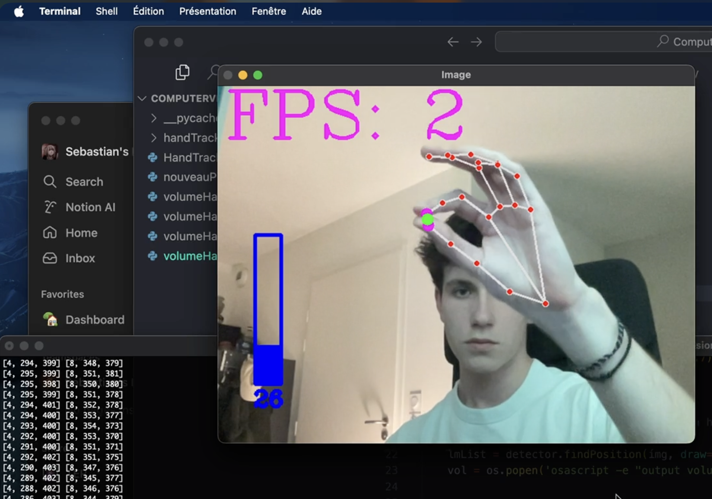

# Hand movement detection with Python and MediaPipe

Github Documentation
This project uses computer vision to detect and track hand movements in real-time. Using MediaPipe's hand tracking library, it can identify hand landmarks and gestures. Optimized by multithreadding, this program can recognize different hand positions and movements, making it useful for gesture-based control systems.

<a href="assets/img.png">

## Features

- Real-time hand detection and tracking
- Gesture recognition
- Multiple hand support
